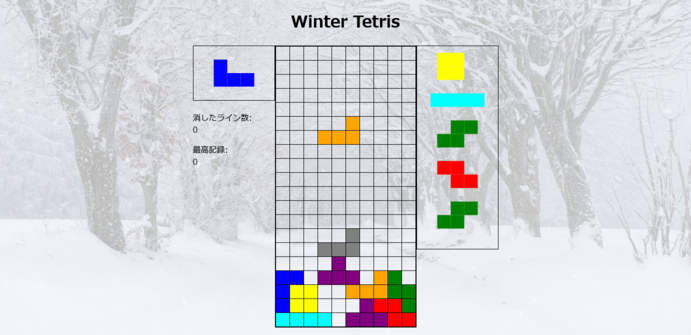
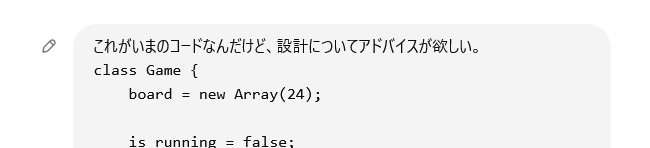

<!-- 本スライドはmarpを利用して生成しました。marpをインストールして、marp presentation --html で変換できるはずです。 -->

# HTML + JSでTetrisを作って得た知見を紹介する。

---

## 本発表の構成

1. 作ったものの紹介
2. 実際に動くゲームを作って感じたことの共有
3. 誰得小ネタ

---

## 本発表の構成

1. 作ったものの紹介
2. 実際に動くゲームを作って感じたことの共有
3. 誰得小ネタ
4. ？？？

注意: 僕の主観がめちゃくちゃ入っています。

---

## 1. 作ったものの紹介

 

<ul>
<li>名前: Winter Tetris</li>
<li>製作期間: 2週間以上</li>
<li>使用技術: HTML + native JS</li>
</ul>

いつものごとくgithubで公開されています。
- リポジトリ: [https://github.com/InTheBloom/tetris](https://github.com/InTheBloom/tetris)
- 実際に遊べるデモページ: [https://inthebloom.github.io/tetris/](https://inthebloom.github.io/tetris/)

---

## 1. 作ったものの紹介

### 特徴
テトリスのルールにかなり準拠している。
- Super Rotation System対応。ミノの回転入れができます。
- 横移動が溜めの後早くなる。
- ミノの最低高度が下がるまでは15回の設置猶予がある。
- 他にもいくつか細かい点にこだわっている。

---

## 1. 作ったものの紹介

是非遊んでみてね&#x1f61a;&#x1f61a;&#x1f61a;

---

## 2. 実際に動くゲームを作って感じたことの共有

※こっちが本題

ゲーム作り、**めっちゃ大変**だった。正直完成に持って行けると思ってなかった。

締め切り開発駆動をしているせいで、マジでギリギリになった。
このスライドは今日の朝7:00に書いてます。

---

## 2. 実際に動くゲームを作って感じたことの共有

何が大変なのか？

---

## 2. 実際に動くゲームを作って感じたことの共有

何が大変なのか？

→3つの壁を抜ける必要があった。

---

## 2. 実際に動くゲームを作って感じたことの共有

何が大変なのか？

→3つの壁を抜ける必要があった。

1. 作りたいもの自体への理解(仕様の把握)
2. 作りたいものをうまく分割して設計図を作ること(クラス分割など)
3. 実際の実装方法などの解決
(canvas API、DOM APIとその実装パターンの理解)

---

## 2. 実際に動くゲームを作って感じたことの共有

何が大変なのか？

→3つの壁を抜ける必要があった。

1. 作りたいもの自体への理解(仕様の把握)
2. 作りたいものをうまく分割して設計図を作ること(クラス分割など)
3. 実際の実装方法などの解決
(canvas API、DOM APIとその実装パターンの理解)

→具体例と、今回どう対処したかを載せます。

---

## 2. 実際に動くゲームを作って感じたことの共有

1. 作りたいもの自体への理解(仕様の把握)

---

## 2. 実際に動くゲームを作って感じたことの共有

1. 作りたいもの自体への理解(仕様の把握)
e.g.
- テトリミノの移動のルール
- 回転のルール

---

## 2. 実際に動くゲームを作って感じたことの共有

1. 作りたいもの自体への理解(仕様の把握)
e.g.
- テトリミノの移動のルール
- 回転のルール

→適切な資料をさがしました。

- [テトリス（tetris）のガイドラインを理解する by ki\_ki33](https://qiita.com/ki_ki33/items/35566f052af7b916607b)
- [SRS Super Rotation System](https://tetrisch.github.io/main/srs.html)

---

## 2. 実際に動くゲームを作って感じたことの共有
2. 作りたいものをうまく分割して設計図を作ること(クラス分割など)

---

## 2. 実際に動くゲームを作って感じたことの共有
2. 作りたいものをうまく分割して設計図を作ること(クラス分割など)

→これは正直どうしようもなかった。(このプロジェクト、実は設計がボロボロ)
場数と試行錯誤がものをいう気がする。

---

## 2. 実際に動くゲームを作って感じたことの共有
2. 作りたいものをうまく分割して設計図を作ること(クラス分割など)

今回は最初Gameというクラスにすべての情報をのせるところからスタートした。

メンバ変数を振り回すことに行き詰ってきたら別クラスへの分割を考える。(with Chat GPT)

---

## 2. 実際に動くゲームを作って感じたことの共有
2. 作りたいものをうまく分割して設計図を作ること(クラス分割など)

最終的に7個のclassに分かれた。(詳細はコードを見て欲しい。)
→実際はclass同士が密結合している場所が割とあるし、責任の分割が全然できていない。
多くの仕事を一つのクラスが抱え込みがちな傾向がある。

---

## 2. 実際に動くゲームを作って感じたことの共有
2. 作りたいものをうまく分割して設計図を作ること(クラス分割など)

最終的に7個のclassに分かれた。(詳細はコードを見て欲しい。)
→実際はclass同士が密結合している場所が割とあるし、責任の分割が全然できていない。
多くの仕事を一つのクラスが抱え込みがちな傾向がある。

→苦しい～～～～たすけて～～～

(友達にコード見せたら地獄すぎてめっちゃ笑われた)

---

## 2. 実際に動くゲームを作って感じたことの共有
2. 作りたいものをうまく分割して設計図を作ること(クラス分割など)

多分ここを一発でうまくやる方法はない。
ありがちなパターンを抑えながら策に溺れないように運用するのが良いかと思う。
(多少ゴリ押してもいいという意)

---

## 2. 実際に動くゲームを作って感じたことの共有
3. 実際の実装方法などの解決

---

## 2. 実際に動くゲームを作って感じたことの共有
3. 実際の実装方法などの解決

ここを具体的に書くと書ききれないので、具体例が気になる人は聞いてください。
後ろのスライドでは実装に向き合う時に必要な(？)精神論を言います。

---

## 2. 実際に動くゲームを作って感じたことの共有
3. 実際の実装方法などの解決

**書いたコード量**がものを言うと思っている。

---

## 2. 実際に動くゲームを作って感じたことの共有
3. 実際の実装方法などの解決

**書いたコード量**がものを言うと思っている。
リファレンスを見ながらとりあえず動くものをたくさん書いてみるのが近道？

---

## 2. 実際に動くゲームを作って感じたことの共有
3. 実際の実装方法などの解決

**書いたコード量**がものを言うと思っている。
リファレンスを見ながらとりあえず動くものをたくさん書いてみるのが近道？

実際、今まで作ってきた[Array visualizer](https://github.com/InTheBloom/array-visualizer)君と[Mo visualizer](https://github.com/InTheBloom/mo-visualizer)君の経験がめちゃくちゃ活きている感じがする。

---

## 2. 実際に動くゲームを作って感じたことの共有
3. 実際の実装方法などの解決

**書いたコード量**がものを言うと思っている。
リファレンスを見ながらとりあえず動くものをたくさん書いてみるのが近道？

実際、今まで作ってきた[Array visualizer](https://github.com/InTheBloom/array-visualizer)君と[Mo visualizer](https://github.com/InTheBloom/mo-visualizer)君の経験がめちゃくちゃ活きている感じがする。

→今いきなりpygameでなんか作ってと言われたら、目先の方針すら立たないのでめっちゃ困る。

---

## 2. 実際に動くゲームを作って感じたことの共有
3. 実際の実装方法などの解決

結論: 最初は大量の時間を投入してめっちゃ頑張るしかない。(私見)

---

## 2. 実際に動くゲームを作って感じたことの共有
3. 実際の実装方法などの解決

結論: 最初は大量の時間を投入してめっちゃ頑張るしかない。(私見)

めっちゃ頑張るためにも、強烈なモチベーションが必要。
今回の僕の場合今日という締め切りがモチベーションになっていた。

---

## 2. 実際に動くゲームを作って感じたことの共有

### 総括

---

## 2. 実際に動くゲームを作って感じたことの共有

### 総括

- ゲーム作りは想像以上に**地道で、大変で、難しい。**
- めちゃくちゃ鍛えられるが、相当なモチベーションがないと厳しい。

---

## 3. 誰得小ネタ集

---

## 3. 誰得小ネタ1

livereloadというライブラリのpythonパッケージがあります。
これHTML + JS書く人にマジでおすすめ。
ファイルを保存するとブラウザを勝手にリロードしてくれる。

[【python】livereloadを使って画面を自動更新するWebページを作ってみる](https://rikoubou.hatenablog.com/entry/2024/02/28/114526)

---

## 3. 誰得小ネタ2

上記方法でブラウザリロードをしていると、なんか反映されない時があります。
そういう時は大体キャッシュが悪さしているので、強制リロードすると良いっぽいです。
ctrl + shift + Rでできる。

---

ご清聴ありがとうございました！！！！！

